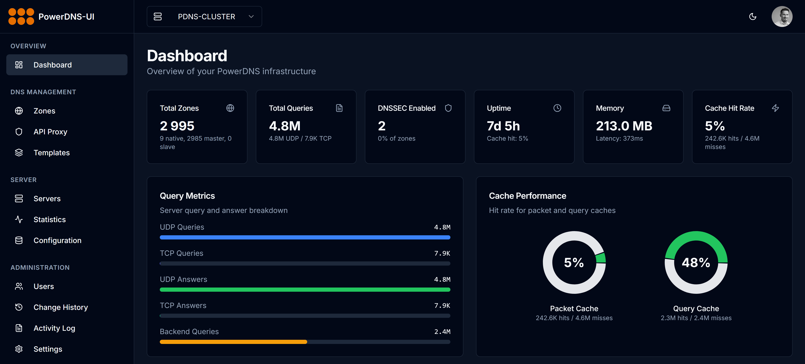

<p align="center">
  
</p>

<h1 align="center">PowerDNS-UI</h1>

<p align="center">
  <strong>Modern web interface for PowerDNS management</strong>
</p>

---

## Overview

**PowerDNS-UI** is a modern, self-hosted web interface for managing PowerDNS Authoritative servers. Built as a lightweight alternative to PowerDNS-Admin, it provides zone and record management, bulk operations, LDAP/local authentication.

<!-- <p align="center">
  
</p> -->

---

## Quick Start

```bash
docker run -d --name powerdns-ui -p 3000:3000 --restart unless-stopped ghcr.io/adminsyspro/powerdns-ui:latest
```

Then open `http://your-server:3000` and configure your PowerDNS server connection.

---

## Features

| Feature | Description |
|---|---|
| **Zone Management** | Create, edit, delete, and export DNS zones (Native, Master, Slave) |
| **Record Editing** | Full CRUD for all record types (A, AAAA, CNAME, MX, TXT, SRV, CAA, etc.) |
| **Multi-Selection** | Bulk delete, enable, and disable records and zones |
| **Pending Changes** | Review and validate changes before applying them to the server |
| **Change History** | Track all modifications with diff view and timeline |
| **Global Search** | Search across zones, records, and IPs |
| **Zone Switcher** | Quickly navigate between zones with instant search |
| **Record Export** | Export records as text, CSV, or PDF |
| **LDAP Authentication** | Integrate with Active Directory / LDAP |
| **Local Authentication** | Built-in user management with bcrypt passwords |
| **Multi-Server** | Connect to multiple PowerDNS instances |
| **DNSSEC Status** | View DNSSEC status per zone |
| **Real-Time Sync** | Background sync with local SQLite cache for fast pagination |
| **Dark Mode** | Full dark/light theme support |
| **Responsive** | Works on desktop, tablet, and mobile |

---

## Configuration

### Environment Variables

| Variable | Default | Description |
|---|---|---|
| `NODE_ENV` | `production` | Node environment |
| `PORT` | `3000` | HTTP port |
| `HOSTNAME` | `0.0.0.0` | Listen address |

Server connections and LDAP settings are configured through the web UI at **Settings**.

### Reverse Proxy (Nginx)

```nginx
server {
    listen 443 ssl;
    server_name dns.example.com;

    ssl_certificate     /etc/ssl/certs/dns.pem;
    ssl_certificate_key /etc/ssl/private/dns.key;

    location / {
        proxy_pass http://127.0.0.1:3000;
        proxy_set_header Host $host;
        proxy_set_header X-Real-IP $remote_addr;
        proxy_set_header X-Forwarded-For $proxy_add_x_forwarded_for;
        proxy_set_header X-Forwarded-Proto $scheme;
    }
}
```

---

## Requirements

- Docker & Docker Compose
- PowerDNS Authoritative 4.x with API enabled
- Network access to PowerDNS API (default port 8081)

---

## License

MIT — Free for personal and commercial use.

## Support

- [GitHub Issues](https://github.com/adminsyspro/powerdns-ui/issues)
