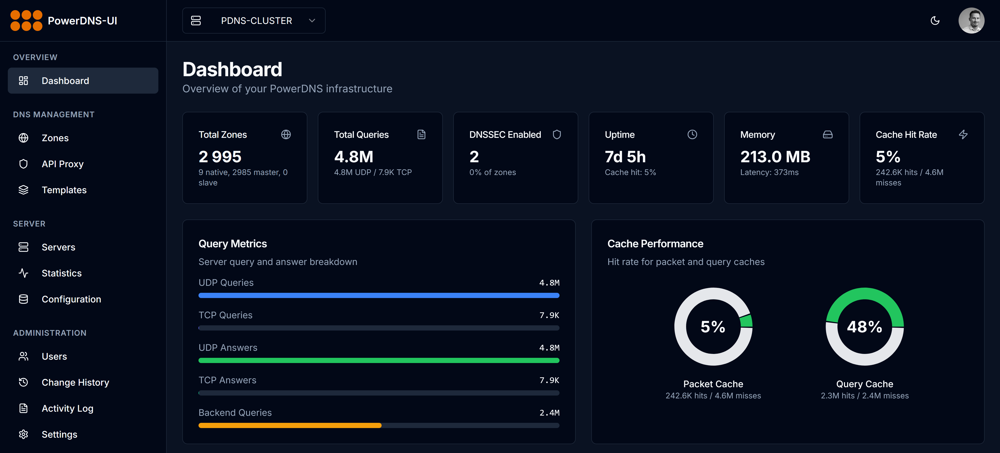

<p align="center">
  
</p>

<h1 align="center">PowerDNS-UI</h1>

<p align="center">
  <strong>PowerDNS management UI with a built-in API proxy for controlled automation</strong>
</p>

<p align="center">
  <a href="https://sonarcloud.io/summary/overall?id=adminsyspro_powerdns-ui"></a>
  <a href="https://sonarcloud.io/summary/overall?id=adminsyspro_powerdns-ui"></a>
  <a href="https://sonarcloud.io/summary/overall?id=adminsyspro_powerdns-ui"></a>
</p>

---

## Overview

**PowerDNS-UI** is a modern, self-hosted control plane for PowerDNS Authoritative servers. It combines a clean web interface for DNS administration with a built-in PowerDNS-compatible API proxy for automation, ACME DNS-01 challenges, and delegated API access.

Built as a lightweight alternative to PowerDNS-Admin, it provides zone and record management, pending-change validation, change history, LDAP/local authentication, multi-server connections, and granular token-based API access without exposing your raw PowerDNS API directly.

Use it as:

- A day-to-day web UI for managing zones and records.
- A secure API gateway in front of PowerDNS for certbot, lego, external services, and internal automation.

<p align="center">
  
</p>

---

## Quick Start

```bash
docker run -d --name powerdns-ui -p 3000:3000 --restart unless-stopped ghcr.io/adminsyspro/powerdns-ui:latest
```

Then open `http://your-server:3000` — default credentials: **admin** / **admin**

---

## Persistence & Secrets

PowerDNS-UI stores all of its state — users, groups, LDAP / OIDC config,
PowerDNS connections, audit history, encrypted credentials — in
`/app/data/cache.db` inside the container. This path **must** be mounted on
a Docker volume to survive image updates:

```yaml
services:
  powerdns-ui:
    volumes:
      - powerdns-ui-data:/app/data

volumes:
  powerdns-ui-data:
```

The provided `docker-compose.yml` already does this. After it, the standard
update flow is safe:

```sh
docker compose pull && docker compose up -d
```

### Required secrets

Two environment variables must be set and **stable** across upgrades:

| Variable | Purpose | Safe to rotate? |
|---|---|---|
| `AUTH_SECRET` | Signs session JWTs | ✅ Yes — every active session is invalidated (users re-login) |
| `APP_SECRET` | Derives the encryption key for stored secrets (LDAP bind password, OIDC client secret, PowerDNS API key, …) | ❌ **No** — rotating this makes every encrypted secret in the DB unreadable until the previous value is restored or the affected settings are re-entered via the UI |

For a fresh deployment, generate both with:

```sh
./scripts/init-secrets.sh
```

This writes a `.env` (chmod 600) next to your `docker-compose.yml` with two
distinct random values. Back this file up — losing `APP_SECRET` is
equivalent to losing every encrypted credential in the database.

### Upgrading an existing deployment

Until this release, PowerDNS-UI used a single `AUTH_SECRET` for both
session signing and encryption. On first start after upgrade, `APP_SECRET`
falls back to `AUTH_SECRET` so nothing breaks — but `docker compose up`
now refuses to start unless both are explicitly set. The minimal upgrade
step is:

1. Add `APP_SECRET=<same value as AUTH_SECRET>` to your `.env`.
2. `docker compose pull && docker compose up -d`.
3. From that point on, you can rotate `AUTH_SECRET` freely without
   touching `APP_SECRET`.

A loud warning is logged at startup if the encryption key appears to
have changed since stored secrets were encrypted (detected by trying to
decrypt the LDAP bind password row). The app keeps running so you can
recover via Settings → LDAP Authentication.

---

## Features

| Feature | Description |
|---|---|
| **PowerDNS API Proxy** | Expose a controlled PowerDNS-compatible API without giving clients direct access to the PowerDNS backend |
| **Granular API Access** | Issue per-client tokens with zone-level permissions, record-level ACLs, regex rules, ACME shortcuts, and request logs |
| **Zone Management** | Create, edit, delete, and export DNS zones (Native, Master, Slave) |
| **Record Editing** | Full CRUD for all record types (A, AAAA, CNAME, MX, TXT, SRV, CAA, etc.) |
| **Multi-Selection** | Bulk delete, enable, and disable records and zones |
| **Pending Changes** | Review and validate changes before applying them to the server |
| **Change History** | Track all modifications with diff view and timeline |
| **Global Search** | Search across zones, records, and IPs |
| **Zone Switcher** | Quickly navigate between zones with instant search |
| **BIND Zone Import** | Import BIND zone files to create new zones or stage records into existing zones |
| **Nameserver Pools** | Configure reusable NS pools and apply them during zone creation |
| **Record Export** | Export records as text, CSV, or PDF |
| **LDAP Authentication** | Integrate with Active Directory / LDAP |
| **Local Authentication** | Built-in user management with bcrypt passwords |
| **Multi-Server** | Connect to multiple PowerDNS instances |
| **DNSSEC Status** | View DNSSEC status per zone |
| **Real-Time Sync** | Background sync with local SQLite cache for fast pagination |
| **Dark Mode** | Full dark/light theme support |
| **Responsive** | Works on desktop, tablet, and mobile |

---

## API Proxy

PowerDNS-UI includes a built-in API proxy compatible with the PowerDNS Authoritative API. Each token can be limited to specific zones and record patterns, making it suitable for scoped automation and delegated DNS access.

This is useful for:

- **ACME DNS-01 automation** — allow certbot, lego, or other ACME clients to update only `_acme-challenge` TXT records.
- **Delegated DNS management** — give teams or services access to selected zones without full PowerDNS API credentials.
- **Public/private separation** — expose proxy endpoints publicly while keeping the admin UI and PowerDNS API on private networks.
- **Auditing** — review API requests, status codes, zones, client IPs, latency, and errors from the UI.
- **Migration** — import an existing `powerdns-api-proxy` config and keep existing hashed tokens valid.

### How it works

External clients authenticate with an API token via the `X-API-Key` header. Each token (called an **API Access**) defines which zones can be accessed and which records can be modified.

```
Client (certbot) → Nginx → PowerDNS-UI Proxy → PowerDNS API
                            ↕
                    Token validation
                    Zone filtering
                    Record-level ACL
```

### API Access features

- **Token-based authentication** — SHA-512 hashed tokens, generated and displayed once
- **Per-zone permissions** — restrict which zones a token can read/write
- **Record-level rules** — allow specific records (exact match) or patterns (regex)
- **ACME support** — auto-allow `_acme-challenge.*` TXT records for Let's Encrypt
- **Request logging** — real-time logs with method, status, zone, IP, duration, and errors
- **Config import** — import existing `config.yml` from powerdns-api-proxy

### Compatible endpoints

| Method | Path | Description |
|--------|------|-------------|
| GET | `/api/v1/servers/{id}/zones` | List zones (filtered by permissions) |
| GET | `/api/v1/servers/{id}/zones/{zone}` | Get zone details (records filtered) |
| PATCH | `/api/v1/servers/{id}/zones/{zone}` | Update records (validated against ACL) |
| PUT | `/api/v1/servers/{id}/zones/{zone}/notify` | Notify zone |
| GET | `/health/pdns` | Health check (no auth) |
| GET | `/info/allowed` | List permissions for the calling token |

### Migration from powerdns-api-proxy

1. In the UI, go to **API Proxy** and click **Import** to paste your existing `config.yml`
2. Existing `token_sha512` values are preserved — client tokens remain valid
3. Update your Nginx config to point to PowerDNS-UI (see below)

### Nginx configuration (recommended)

For security, expose only the proxy endpoints on the public-facing domain. The UI should be accessed through a separate vhost.

**Proxy vhost** (e.g., `ssl.example.com` — used by certbot and external clients):

```nginx
server {
    listen 443 ssl;
    server_name ssl.example.com;

    ssl_certificate     /etc/letsencrypt/live/ssl.example.com/fullchain.pem;
    ssl_certificate_key /etc/letsencrypt/live/ssl.example.com/privkey.pem;
    ssl_protocols TLSv1.2 TLSv1.3;
    ssl_ciphers HIGH:!aNULL:!MD5;

    location /api/v1/ {
        proxy_pass http://127.0.0.1:3000;
        proxy_set_header Host $host;
        proxy_set_header X-Real-IP $remote_addr;
        proxy_set_header X-Forwarded-For $proxy_add_x_forwarded_for;
        proxy_set_header X-Forwarded-Proto $scheme;
    }

    location /health/pdns {
        proxy_pass http://127.0.0.1:3000;
        proxy_set_header Host $host;
    }

    location /info/allowed {
        proxy_pass http://127.0.0.1:3000;
        proxy_set_header Host $host;
        proxy_set_header X-Real-IP $remote_addr;
        proxy_set_header X-Forwarded-For $proxy_add_x_forwarded_for;
    }

    location / {
        return 404;
    }
}
```

**UI vhost** (e.g., `dns-admin.example.com` — used by administrators):

```nginx
server {
    listen 443 ssl;
    server_name dns-admin.example.com;

    ssl_certificate     /etc/ssl/certs/dns-admin.pem;
    ssl_certificate_key /etc/ssl/private/dns-admin.key;

    location / {
        proxy_pass http://127.0.0.1:3000;
        proxy_set_header Host $host;
        proxy_set_header X-Real-IP $remote_addr;
        proxy_set_header X-Forwarded-For $proxy_add_x_forwarded_for;
        proxy_set_header X-Forwarded-Proto $scheme;
    }
}
```

---

## Configuration

### Environment Variables

| Variable | Default | Description |
|---|---|---|
| `NODE_ENV` | `production` | Node environment |
| `PORT` | `3000` | HTTP port |
| `HOSTNAME` | `0.0.0.0` | Listen address |

Server connections and LDAP settings are configured through the web UI at **Settings**.

### Reverse Proxy (Nginx)

```nginx
server {
    listen 443 ssl;
    server_name dns.example.com;

    ssl_certificate     /etc/ssl/certs/dns.pem;
    ssl_certificate_key /etc/ssl/private/dns.key;

    location / {
        proxy_pass http://127.0.0.1:3000;
        proxy_set_header Host $host;
        proxy_set_header X-Real-IP $remote_addr;
        proxy_set_header X-Forwarded-For $proxy_add_x_forwarded_for;
        proxy_set_header X-Forwarded-Proto $scheme;
    }
}
```

---

## Requirements

- Docker & Docker Compose
- PowerDNS Authoritative 4.x with API enabled
- Network access to PowerDNS API (default port 8081)

---

## License

MIT — Free for personal and commercial use.

## Support

- [GitHub Issues](https://github.com/adminsyspro/powerdns-ui/issues)
